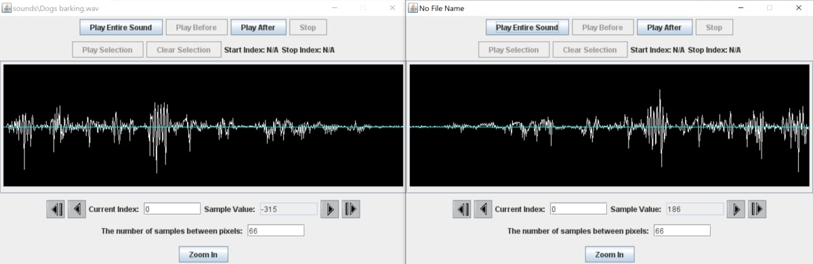

# JES-sound-processing-techniques
This is an example file that includes examples of sound processing techniques, including:
* How to Change the Volume of a Sound Clip
* How to Reverse a Sound Clip
* How to Join Two Sound Clips Together

## To Run

* Open the Sounds.py file (inside JES-example) using the JES application.
* Run the available functions using the command line.
* Select a compatible WAV file. 

## Example

